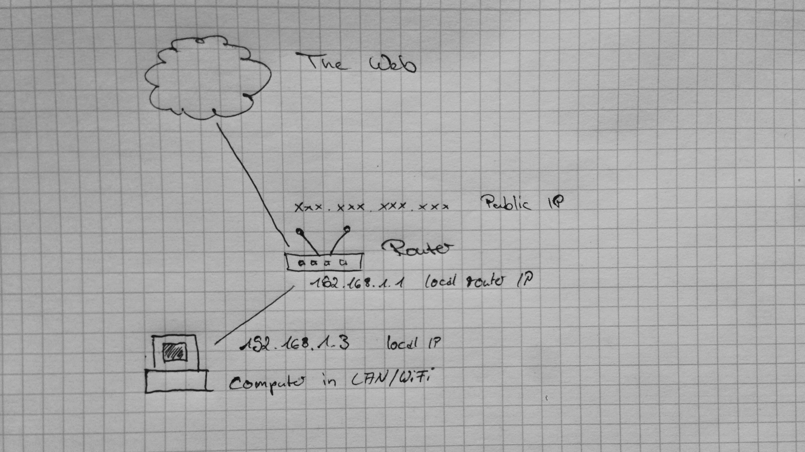
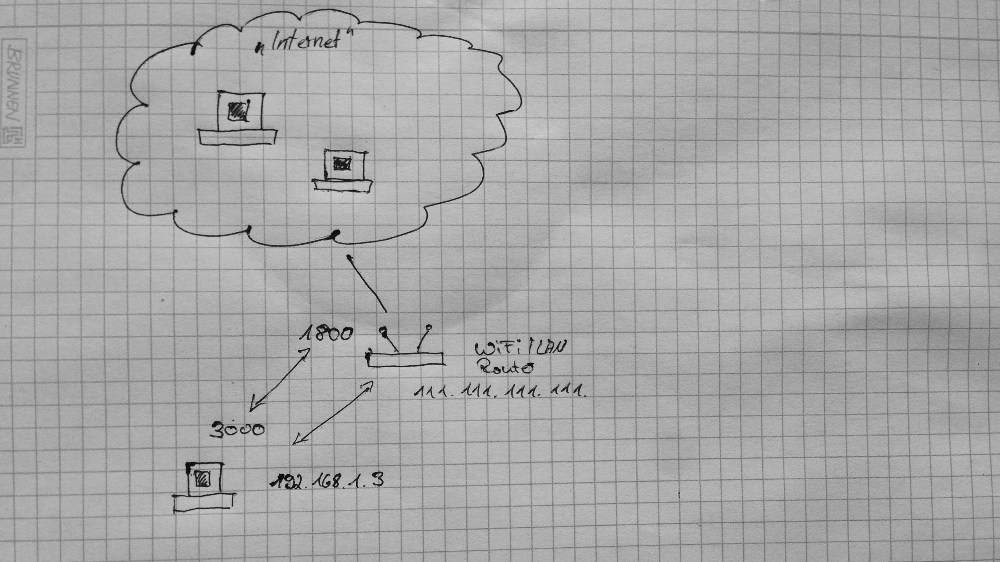

# Connecting IOT Networks Behind a NAT with Grenache

Some of you already know that the Bitfinex team is, like many things in crypto, highly distributed. Our architecture is distributed as well. Our microservices push the Bittorrent protocol to its limits.

Today we want to take a look how we can connect IOT applications between different NAT based local networks. We will solve a problem many who tried to run a server at home have run into. We will take a look how UDP Holepunching works, and create a small demo application with Grenache.

## Routing with local networks

Most routers we use at home today still use NAT. They have a public IP and an internal one, for the local network. Computers on the internal network are not reachable from the outside without routing.



One solution to solve the problem is create a manual routing table. The table maps a port on our public IP address to an internal IP and port. This way our server becomes reachable from the public internet:




In this diagram our ISP assigns the IP `111.111.111.111` to us. If someone connects to this IP, the request will arrive at our router. In our small network a server is running with the IP `192.168.1.3`. The two arrows or show a routing we set up, the port `3000` on our server is mapped to the port `1800`. When a request arrives at our public IP `111.111.111.111` on port `1800`, the router routes the packet to `192.168.1.3`, port `3000`.


Sometimes we can’t create or maintain a routing table for technical or practical reasons. In those cases, we can use a practice called “UTP Holepunching”. With a UTP Holepunch, we let the router create the mapping.

## How UDP/UTP Holepunching works

With UTP Holepunching we let the router create the mentioned mapping for us. Many popular applications rely on it, its a feature used by many applications. Some of them are BitTorrent and voice chat clients.

Imagine again our server at home with a service listening on `3000`. Now we send a UDP packet to another server on the internet, from exact the same internal IP and port (`192.168.1.3:3000`). Let's say the server on the internet has the IP `8.8.8.8` and accepts data on port `1337`. Our router will notice the outgoing packet and remember its destination. Our router will also assign a new external port when it sends the packet to the external destination. Let's pretend the router uses the port `24000`.  For the external server the UDP packet then comes from `111.111.111.111:24000`, but on our internal network we sent the packet from `192.168.1.3:3000`.

Lets say our external target server now sends back a UDP packet within a short amount of time. Our router still remembers that we just sent out data from this port and that it was originating from `192.168.1.3:3000`. So it will route the packet to our local server, as a service for us. Now we have created a routing entry.

## UDP Holepunching with Grenache

Grenache gives us great flexibility in creating microservice networks. Grenache uses the BitTorrent protocol for peer discovery.

With a UDP Holepunch transport for Grenache its easy to connect services between different local networks to share data. A good example are IOT applications. A local server offers services that should be accessible from the public internet. The service could provide any data we want. We build a service inspired by the fibonacci number generating service we created some time ago in http://blog.bitfinex.com/tutorial/bitfinex-loves-microservices-grenache/. This time we will make it ready for NAT home routers. We will also extend the fibonacci calculation to return the sequence of numbers.

To start, we have to spin up our own local BitTorrent based network:

```
npm i -g grenache-grape

grape --dp 20001 --aph 30001 --bn '127.0.0.1:20002'
grape --dp 20002 --aph 40001 --bn '127.0.0.1:20001'
```

Easy, isn't it? We are running our own private, BitTorrent network now.

### The fibonacci calculation service

Our project will have two parts. A calculation service, which will run in our NAT at home. In the second part of the article we create a consumer, which needs to be located on a non-firewalled server. Later we will connect both with a UDP Holepunch.

Connecting RPC services where all are behind a NAT is possible, too, we need a third party. The third party helps with the exchange of the IPs and ports. In case you are interested in the broker, there is an example for a setup with broker in [the Grenache UTP repository](https://github.com/bitfinexcom/grenache-nodejs-utp/tree/master/examples/nat_w_broker).

We will use `grenache-nodejs-utp` instead of the HTTP or WebSocket transport used in other articles. It will provide us helper methods for holepunching. For communication it uses UDP/UTP sockets.

Let's start with coding. Our calculation service will be located in a file called `rpc_server_behind_nat.js`. The heart of our service will be the calculation of the fibonacci sequence by length. When we pass in the maximum length as parameter, the function will return us the fibonacci number sequence of that length:

```js
function fibonacci (length) {
  const res = []

  function _fibonacci (n) {
    if (n <= 1) {
      return 1
    }
    return _fibonacci(n - 1) + _fibonacci(n - 2)
  }

  for (let i = 0; i < length; i++) {
    res.push(_fibonacci(i))
  }

  return res
}
```

When we now call `fibonacci(10)`, we receive `[1, 1, 2, 3, 5, 8, 13, 21, 34, 55]` as result, the first ten numbers in the sequence.

Now we have to make everything available on the network. Make sure you have all required dependencies installed:

```
npm i --save grenache-nodejs-link
npm i https://github.com/bitfinexcom/grenache-nodejs-utp
```

We require the RPC Server component and a component called `Link`:

```js
const { PeerRPCServer } = require('grenache-nodejs-utp')
const Link = require('grenache-nodejs-link')
```

The link will connect to our private BitTorrent network. It will help us with advertising our service to other parties. Later in this article we will use the link for looking up services.

We connect to the small private network we set up with the two `grape` CLI tools:

```js
const link = new Link({
  grape: 'http://127.0.0.1:30001'
})
link.start()
```

Then we inject the link into our server component, so the server can use the connection we just set up:

```js
const peer = new PeerRPCServer(link, {
  timeout: 300000
})
peer.init()
```
As a next step, we have to put our request handler into place. When a new request arrives, we want to calculate the fibonacci sequence and answer the request:

```js
service.on('request', (rid, key, payload, handler, cert, additional) => {
  console.log('received request, calculating & replying...')
  const result = fibonacci(payload.length)
  handler.reply(null, result)
})
```

For the server to work, it has to listen on a port, we will get a free, randomly assigned port:

```js
const service = peer.transport('server')
service.listen()
console.log('listening on', service.port)
```

We now have to announce our fibonacci calculating service on the network. This happens by calling `link.announce`. We will also look for possible consumers of our service to start a UDP holepunch with them by calling `peer.punch`:

```js
setInterval(function () {
  link.announce('fibonacci_worker', service.port, {})
  peer.punch('fibonacci_consumer')
}, 1000)
```

The code for this section is also part of the examples on GitHub: [rpc_server_behind_nat.js](https://github.com/bitfinexcom/grenache-nodejs-utp/blob/fa16176ac1926c797289b8aed0e5e6cc19fd474a/examples/punch_simple_servers/rpc_server_behind_nat.js)


### The data consumer

In the last section we created a calculation service. It runs within our own private BitTorrent network. The calculation service also looks up possible consumers. By sending UDP packets to them with the `punch` method it helps them to establish a connection. This way we can offer a service through our home router even behind a firewalled NAT.

In this section we create a data consumer. The data consumer is not firewalled in this example. [This example in the Grenache UTP repository](https://github.com/bitfinexcom/grenache-nodejs-utp/tree/master/examples/nat_w_broker) implements a solution where both P2P parties can be firewalled.

For the data consumer we require both the RPC client and server. We put the code into a file called `rpc_server_public.js`:

```js
const { PeerRPCServer, PeerRPCClient } = require('grenache-nodejs-utp')
const Link = require('grenache-nodejs-link')
```

Like in the previous section, we set up the link, server and let the server listen for connections:

```js
const link = new Link({
  grape: 'http://127.0.0.1:30001'
})
link.start()

const peerSrv = new PeerRPCServer(link, {
  timeout: 300000
})
peerSrv.init()

const service = peerSrv.transport('server')
service.listen()
console.log('listening on', service.port)
```

We are going to use the RPC client, we have to start it too:

```js
const link2 = new Link({
  grape: 'http://127.0.0.1:30001'
})
link2.start()

const peer = new PeerRPCClient(link2, {})
peer.init()
```

In the data calculation service we were looking up data consumer on the network, to send them a UDP packet. Here we announce our consumer to the network, so it can be found by the calculation service.

```js
setInterval(function () {
  link.announce('fibonacci_consumer', service.port, {})
}, 1000)
```

The other service calls `.punch('fibonacci_consumer')` every second. This looks up a fibonacci consumer on the network, and sends a UDP packet to the IP and port of the consumer.

In our code here we listen for those packets. With the UDP packet that we receive as part of the punch event, we get the public IP and port of the sender.

When we now send network data to this address, the home router routes it to the service running on the local network. This way we can set up an ad-hoc, P2P data connection with a server behind a NAT.

```js
service.on('punch', (other) => {
  console.log('punch from', other)
  console.log('punching back...')
  service.punch(other)

  // establish connection and calculate data
  peer.request(other, { length: 10 }, { timeout: 10000 }, (err, data) => {
    if (err) return console.error(err)

    console.log('got data reply, sequence is:')
    console.log(data)
  })
})

```

Thats all we need for the consumer. Time to connect the different parts! By the way: the code for the consumer is on GitHub, too: The code for this section is also part of the examples on GitHub: [rpc_server_public.js](https://github.com/bitfinexcom/grenache-nodejs-utp/blob/fa16176ac1926c797289b8aed0e5e6cc19fd474a/examples/punch_simple_servers/rpc_server_public.js)

### Testing

After we have created our two services, we can run them on our local machine to see if they connect. With the two local grape instances running, we first run the `rpc_server_public.js`:

```
node rpc_server_public.js
```

Then we boot the consumer:

```
node rpc_server_public.js
```

If everything worked well, we get this output:

```
$ node rpc_server_public.js

listening on 51563
punch from { address: '127.0.0.1', family: 'IPv4', port: 52217, size: 2 }
punching back...
got data reply, sequence is:
[ 1, 1, 2, 3, 5, 8, 13, 21, 34, 55 ]
```

```
node rpc_server_behind_nat.js
listening on 52217
punch from { address: '127.0.0.1', family: 'IPv4', port: 51563, size: 2 }
received request, calculating & replying...
```

If everything works, we can stop the both servers and local Grape instances. We can now start the calculation service behind the NAT and connect from the external consumer to it. For this lets assume our public server has the IP `157.81.109.241`.

We start a Grape instance on the public server:

```
DEBUG=* grape --dp 20001 --aph 30001 --bn '127.0.0.1:20002'
```

Then start a Grape instance locally on your machine, behind a NAT, and connect it to the other Grape:

```
DEBUG=* grape --dp 20002 --aph 30001 --bn '157.81.109.241:20001'
```

On the public server machine, start the consumer now:

```
node rpc_server_public.js
```

Start `rpc_server_behind_nat.js` on your local machine behind the router now. It looks up possible consumers and sends a UDP packet to the consumer. This establishes a temporary ad-hoc routing for the service running in the home network.

When the packet arrives at the public server, it will emit a `punch` event. The public server handles the event and gets the IP/port from the ad-hoc routing. It then kicks of the request for calculation and logs the received result.


### UDP holepunching

In this article we showed the basics of UDP Holepunching. We created a data producer, a small consumer. The example works without an extra registry as connection helper. We hope we inspired you, and it is helpful for your own projects. We use Grenache in production at Bitfinex. If you are interested in distributed systems and very good in JavaScript, we are hiring: https://www.bitfinex.com/careers/senior_software_developer
